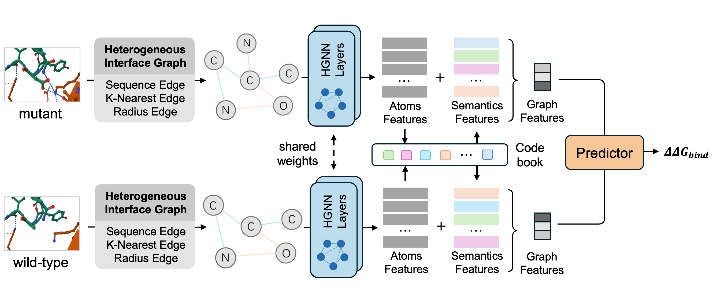

### VQH-AM

## Dependencies
python==3.10 \
dgl==0.9.1.post1 \
numpy==1.26.4 \
scikit-learn==1.6.1 \
torch==2.0.1+cu118 
## Datasets
(1) unzip ./data_preparation/skempi.zip (You can find it in Releases)\
(2) run ./data_preparation/foldx_build.py to built mutations' structures \
(3) run ./data_preparation/process_subgraph.py and ./data_preparation/process_subgraph_WT.py to construct sub graph from complexs' binding interface. \
